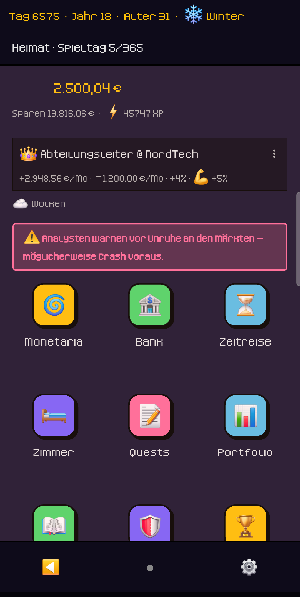
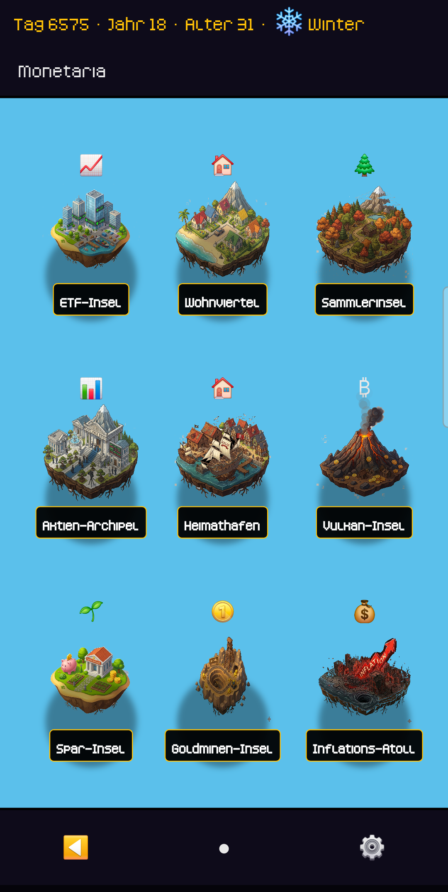
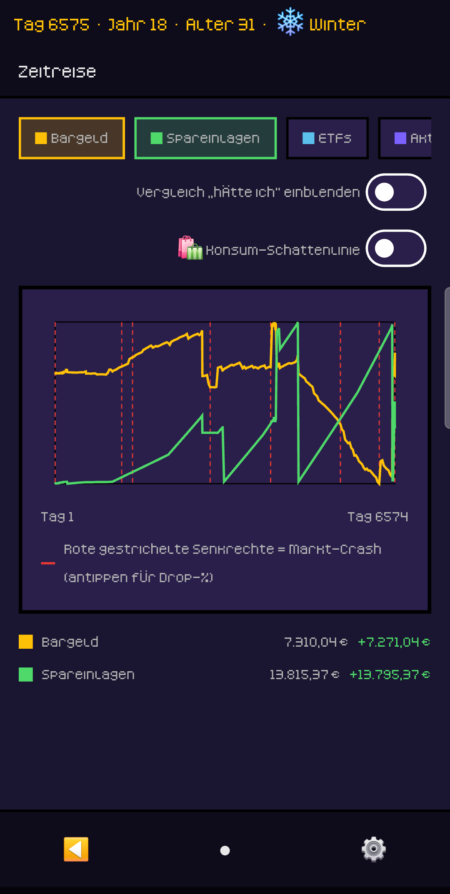
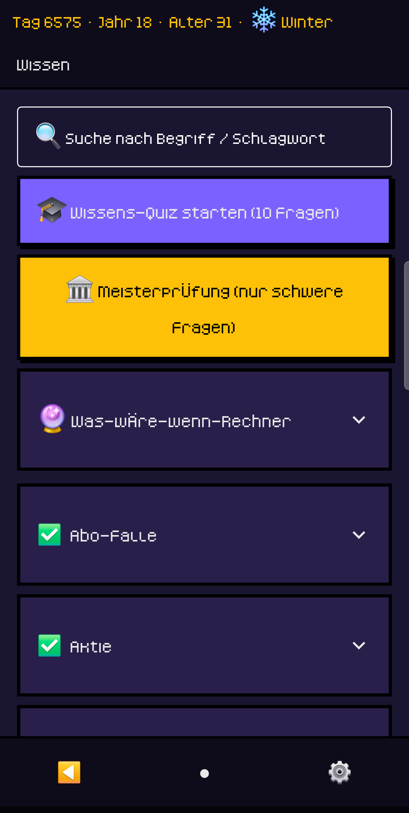
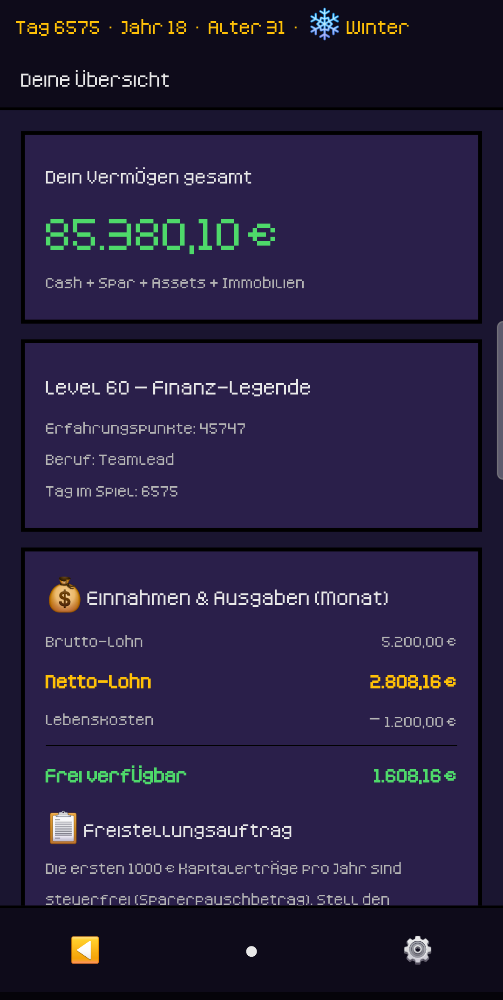
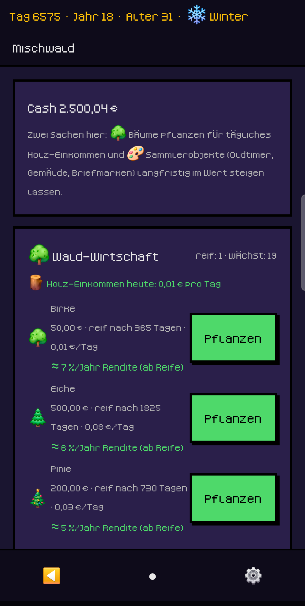

# Finanzgame

Ein Lernspiel über Geld für Jugendliche ab etwa 13 Jahren. Taschengeld
einteilen, sparen, anlegen, abwarten — und sehen, was daraus wird. Flutter +
Flame, Android, komplett offline.

Entstanden als privates Projekt und über viele Testrunden mit einem
jugendlichen Testspieler gewachsen.

> **Das ist eine Simulation, keine Anlageberatung.** Alle Kurse, Firmen,
> Renditen und Preise im Spiel sind erfunden. Echtes Geld verhält sich anders.

## Installieren

Fertige APK unter [Releases](https://github.com/neuerfokus/finanzgame/releases)
— herunterladen, auf dem Gerät antippen, „Unbekannte Quellen" zulassen.

Die Aufnahme bei **F-Droid** ist beantragt:
[fdroiddata!49022](https://gitlab.com/fdroid/fdroiddata/-/merge_requests/49022).
Sobald sie durch ist, steht die App dort im Katalog und aktualisiert sich von
selbst.

Ein Hinweis für den Wechsel: F-Droid signiert mit einem eigenen Schlüssel. Eine
Installation von dort lässt sich deshalb nicht über die APK aus den Releases
legen und umgekehrt. Wer wechselt, sichert vorher den Spielstand über
*Einstellungen → Spielstand sichern* und spielt ihn danach wieder ein.

<p align="center">
  
  
  
  
  
</p>


## Was es kann

- **Tageszyklus statt Echtzeit.** Es passiert nichts, während das Handy in der
  Tasche liegt. Ein Tag endet, wenn man auf „Schlafen" tippt — dann werden
  Erträge, Kosten und Ereignisse gesammelt und in einer Tageszusammenfassung
  gezeigt.
- **Neun Anlageklassen** mit unterschiedlichem Charakter: Sparkonto, ETFs,
  Einzelaktien, Krypto, Edelmetalle, Immobilien, Vorsorge, Sammlerobjekte,
  Bäume — jede auf einer eigenen Insel.
- **Lerninhalte im Spiel**, nicht daneben: 58 Story-Quests (Abo-Falle,
  Phishing, Gruppenzwang, Ratenkauf, Freistellungsauftrag …), Tagesfrage,
  Wissens-Quiz, Glossar als Lern-Tagebuch.
- **Zeitreise**: Jahre vorspulen und den eigenen Vermögensverlauf über alle
  Anlageklassen ansehen.
- **Brücke ins echte Leben**: echte Sparziele eintragen, von einem Elternteil
  bestätigen lassen, dafür im Spiel belohnt werden.

<p align="center">
  
  
  
</p>

<p align="center"><sub>Spar-Insel · Portfolio · Mischwald — alle Bilder aus dem laufenden Spiel,
Pixel-Font und Farben wie sie sind.</sub></p>

## Haltung

- Keine echten Marken, keine echten Aktien — alles fiktiv.
- Keine Lootboxen, keine Mikrotransaktionen, keine Glücksspiel-Mechaniken.
- Kein Tracking, kein Analytics, keine Cloud. Die App sendet nichts.
- Anti-Konsum als Haltung, ohne Moralkeule: Konsumieren ist spielbar und zeigt
  seine Folgen.
- Geschlechtsneutral, ohne Abfrage. Weibliche und männliche Figuren stehen
  gleichwertig und zu denselben Kosten nebeneinander; Titel benennen die
  Fähigkeit, nicht die Person.

## Datenschutz

Alles bleibt auf dem Gerät. Kein Konto, keine Registrierung, keine
personenbezogenen Daten.

Und das ist nicht nur ein Versprechen: **das fertige APK fragt die
INTERNET-Berechtigung gar nicht erst an.** Android lässt die App damit keine
Netzwerkverbindung aufbauen, selbst wenn irgendwo Code das versuchen würde.
Nachprüfbar am gebauten Paket:

```bash
aapt dump permissions build/app/outputs/flutter-apk/app-release.apk
```

Details: [PRIVACY.md](PRIVACY.md).

## Bauen

Flutter 3.41 / Dart 3.11. Die genaue Fassung steht in
[`.flutter-version`](.flutter-version) — eine Zeile, maschinenlesbar. Der
F-Droid-Build liest sie von dort, statt eine Version im Rezept zu verdrahten;
wer selbst baut, kann sich daran halten.

```bash
flutter pub get
dart run build_runner build --delete-conflicting-outputs
flutter test
flutter analyze --fatal-infos
flutter build apk --release
```

Ohne `android/key.properties` wird mit dem Debug-Keystore signiert — zum
Entwickeln genau richtig.

## Lizenz

- **Quelltext**: [GPL-3.0-or-later](LICENSE)
- **Eigene Inhalte** (Quests, Glossar, App-Icon): CC-BY-SA-4.0
- **Kenney-Assets** (Grafik, Fonts, Sound, Musik): CC0
- **Twemoji** (Möbel-Symbole): CC-BY-4.0, © Twitter, Inc. und Mitwirkende

Pro Datei nachgehalten in [ASSETS.md](ASSETS.md), Lizenztexte unter
`LICENSES/`. Die App zeigt die Namensnennungen unter *Einstellungen → Über &
Lizenzen*.

## Mitmachen

Siehe [CONTRIBUTING.md](CONTRIBUTING.md). Fehler und Ideen gern als Issue.

## Unterstützen

Das Spiel ist kostenlos, werbefrei und ohne In-App-Käufe — und bleibt es. Wer
die Weiterentwicklung freiwillig unterstützen möchte, kann ein Trinkgeld
geben: [ko-fi.com/finanzgame](https://ko-fi.com/finanzgame)

Ohne Gegenleistung. Es schaltet nichts frei, ändert nichts im Spiel, und es
gibt kein Abzeichen dafür — sonst wäre es ein Kauf digitaler Inhalte statt
einer freiwilligen Zuwendung.

Derselbe Link liegt in der App unter *Einstellungen → Unterstützen*, sichtbar
nur bei einem eingetragenen Geburtsjahr ab 18. Die Altersabfrage dort ist
bewusst neutral gehalten und verrät nicht, was von ihr abhängt — das verlangt
Googles Familienrichtlinie. Deshalb steht der Link hier.

## Kontakt

sepp.github@gmail.com · [github.com/neuerfokus/finanzgame](https://github.com/neuerfokus/finanzgame)
